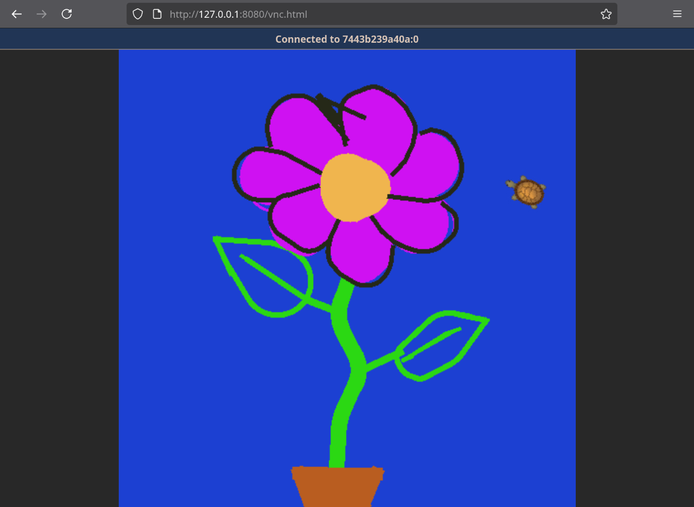

# rosrust-async Examples

This directory contains a handful of examples for the `rosrust-async` crate. 

More technical examples can be found in the `rosrust-async-test` crate, such as: 
* Interop between rosrust & rosrust-async
* Interacting with the ROS [parameter server](https://wiki.ros.org/Parameter%20Server)
* Using [simulation time](https://wiki.ros.org/Clock#Using_Simulation_Time_from_the_.2Fclock_Topic) with the `Clock` module


## Getting Started

These examples assume that you have a ROS Master running locally. The quickest way to get started without needing a full ROS installation is to use the ROS Noetic docker image:

```bash
    docker run -d --name ros_master --network host ros:noetic-ros-core roscore
    cargo run --example example_name
```

Or, if you don't want to use docker's [host network driver](https://docs.docker.com/engine/network/drivers/host/):

```bash
    docker run -d --name ros_master -p 8080:11311 ros:noetic-ros-core roscore
    export ROS_MASTER_URI="http://127.0.0.1:8080"
    cargo run --example example_name
```

## Included Examples
### Turtlesim Teleop
The [`turtle_teleop`](turtle_teleop.rs) example allows a user to draw images with a [turtlesim](https://wiki.ros.org/turtlesim) node.

This is a more complete example that utilizes a mix of publishers, service clients, and parameter server operations.

A containerized [turtlesim](turtlesim/docker-compose.yml) is included for those who want to try things out without needing a full ROS installation. Unlike the other examples, this one is entirely self-sufficient - the compose config will create a dedicated ROS Master container alongside the turtlesim container, so the steps under "Getting Started" do not apply here.

<table align="center" width=100%>
  <tbody>
    <tr>
      <td align="center">
        
        <br>
        <i>A photorealistic drawing of a flower, made using the teleop example.</i>
      </td>
    </tr>
    <tr>
      <td align="center">
        
        <br>
        <i>Teleop example & the containerized turtlesim running together</i>
      </td>
    </tr>
  </tbody>
</table>
 

### Publisher & Subscriber
The [`publisher`](publisher.rs) example repeatedly publishes [String](https://docs.ros.org/en/melodic/api/std_msgs/html/msg/String.html) messages to the `/chatter` topic at a rate of 1Hz.

Both the [`subscriber`](subscriber.rs) & [`subscriber_callback`](subscriber_callback.rs) examples echo messages sent to the `/chatter` topic. The only difference between the two is that the former uses the `Node::subscribe` API, whereas the latter uses `Node::subscribe_callback`.

Since these examples use the standard `String` message, you can also use the `rostopic` CLI tool to interact with them. 
Refer to the comments inside each of the examples for more information.

<table align="center" width=100%>
  <tbody>
    <tr>
      <td align="center">
        
        <br>
        <i>Publisher example interacting with the rostopic CLI tool</i>
      </td>
    </tr>
    <tr>
      <td align="center">
        
        <br>
        <i>Subscriber example interacting with the rostopic CLI tool</i>
      </td>
    </tr>
    <tr>
      <td align="center">
        
        <br>
        <i>Publisher & Subscriber examples running together</i>
      </td>
    </tr>
  </tbody>
</table>

---

### Service Client & Service Server
The [`service_client`](service_client.rs) example prompts the user for a pair of numbers, then attempts to use the `/add_two_ints` service to sum them together. 

The [`service_server`](service_server.rs) example is what actually provides the `/add_two_ints` service. The logic is defined in a simple callback which gets executed each time the server receives an incoming request.

This pair of examples relies on the [`TwoInts`](std_msgs/srv/TwoInts.srv) service description.


<table align="center" width=100%>
  <tbody>
    <tr>
      <td align="center">
        
        <br>
        <i>Service Client & Service Server examples running together</i>
      </td>
    </tr>
  </tbody>
</table>
